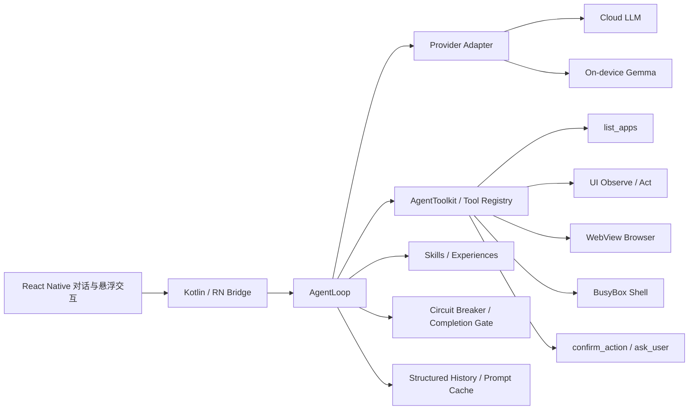

# 豆泡：端侧 Android 通用 AI Agent 项目经历

> 面向简历、技术面试、项目答辩和作品集。涉及个人职责的内容请按实际参与范围取舍，不补充未经验证的业务数据。

## 项目定位

豆泡是一款**端侧原生运行、无需 ADB、以手机自动化为核心，同时具备通用问答能力**的 Android AI Agent。

AgentLoop、工具执行、任务状态和用户交互均运行在手机 App 内；ADB 只用于开发调试和装机，不是产品运行依赖。模型可以根据任务选择直接回答，也可以调用手机 UI、内置浏览器、Shell 和系统能力完成跨应用操作。

> 让大模型在 Android 手机上通过最小工具集自主完成任务，并用视觉与结构双通道、工具层可靠性治理和人工安全卡控，解决真实手机环境中的权限、封闭性和操作不确定性。

## 简历写法

### 一行版

**豆泡｜端侧 Android 通用 AI Agent｜React Native、Kotlin、TypeScript、LLM Tool Calling**

### 精简版

- 基于 Kotlin + React Native 构建无需 ADB 的端侧 Android Agent，采用 `AgentLoop + Tools` 架构，使模型在直接回答、手机代操作、网页访问和 Shell 执行之间自主选择路径。
- 设计以 `list_apps`、`shell_execute`、`browser_use` 和 UI 操作为核心的最小工具集，通过工具扩展能力边界；使用 Shell 承接计算、文本处理和系统查询等确定性任务，减少不必要的视觉推理。
- 面向移动端权限严格、App 封闭且高度依赖视觉信号的问题，构建无障碍树与截图双通道观察体系，在保证视觉覆盖上限的同时利用结构化信息提高定位速度、降低视觉 Token 消耗。
- 将 UI 稳定等待、异步页面变化验证、浮层交互、可调步长滚动和长列表浏览等复杂性下沉到工具层，避免 AgentLoop 堆积特定 App 逻辑。
- 实现工具级循环熔断、高风险操作人工确认、必要信息澄清以及任务完成确认与续跑机制，降低重复操作、越权执行和模型早停风险。
- 参考 Skills 机制建设可共享经验库，通过目录发现与按需读取实现渐进式披露，避免每轮注入全部经验。
- 将提示词拆分为固定 System Prompt、任务级 Runtime Context 和轮次动态状态，结合历史窗口控制和 Prefix Cache 降低重复 Token 消耗。

### 招聘系统短版

基于 Kotlin、React Native 和 TypeScript 开发无需 ADB 的端侧 Android 通用 AI Agent。采用 `AgentLoop + Tools` 架构，以手机自动化为核心，支持无障碍与视觉双通道、WebView 浏览器、BusyBox Shell 和跨应用操作。重点实现工具后验验证、循环熔断、风险确认、Skills 渐进式披露、任务续跑和分层上下文缓存，解决复杂手机 UI 中的视觉成本、异步滞后、重复操作及模型早停问题。

## 项目背景与核心挑战

传统手机自动化依赖固定脚本、坐标录制或针对单个 App 的工作流，页面改版、动态列表和跨应用跳转都容易使脚本失效。大模型虽然提升了泛化能力，但真实个人终端仍存在三类关键难题。

### 1. 权限严格，且视觉能力决定覆盖上限

Android 普通应用无法获得 `adb shell` 或 Root 权限，很多第三方 App 又不完整暴露可访问性语义。在封闭 App 场景中，视觉识别能力决定自动化的覆盖上限；无障碍结构则决定常见页面的速度、稳定性和成本基线。

因此项目同时保留：

- 无障碍树：提供文本、节点、边界和可操作属性，适合快速、低成本定位。
- 视觉截图：处理图标、画布、无语义容器、视觉布局和坐标操作。
- Shell 与浏览器：绕开部分不必经过 UI 的任务路径，提高确定性并减少视觉 Token。

### 2. 个人终端 UI 复杂、App 封闭、操作结果不确定

手机页面包含异步加载、动画、浮层、无限列表、长表格、节点复用和坐标变化。Android 接口返回成功，往往只表示动作被系统接收，不代表目标页面已经变化。

项目把页面稳定等待、节点与坐标回退、滚动距离、页面变化轮询和结果验证下沉到工具层，使 AgentLoop 只负责编排和决策。

### 3. 长任务容易重复、越权、早停和上下文膨胀

模型可能反复点击或滚动，也可能把支付、发送和删除等真实外部影响操作直接执行；复杂任务还可能在目标尚未完成时过早结束。与此同时，截图、无障碍树、工具结果和经验会持续扩大上下文。

项目通过运行时熔断、风险确认、澄清工具、任务完成复核、续跑机制、Skills 渐进披露和分层提示词共同治理这些问题。

## 技术架构



### 分层职责

1. **交互层**：对话、语音、执行过程、悬浮窗、内嵌确认卡片和会话历史。
2. **原生能力层**：Kotlin 提供无障碍、截图、悬浮窗、前台服务、系统 Intent 和 Shell 宿主能力。
3. **编排层**：TypeScript AgentLoop 负责模型调用、工具调度、历史管理和任务终止。
4. **协议层**：内部统一 `tool_call/tool_result`，再适配不同模型 API。
5. **能力层**：应用发现、手机 UI、浏览器、Shell 和用户交互工具。
6. **治理层**：循环熔断、风险确认、澄清、超时、完成复核和后台恢复。

## 核心设计

### 1. `AgentLoop + Tools` 与最小能力闭环

主循环保持通用，只完成以下职责：

1. 根据用户目标和历史调用模型。
2. 解析结构化工具调用。
3. 执行工具并记录真实结果。
4. 根据新状态继续决策，直到完成、失败或需要用户介入。

最小工具集覆盖四类能力：

- `list_apps`：发现手机中真实存在的应用和包名。
- `shell_execute`：执行计算、文本处理、文件操作、系统查询等确定性任务。
- `browser_use`：处理开放网页、实时信息和 DOM 交互。
- UI 工具：观察、点击、输入、滚动、返回和应用切换。

安全确认、用户澄清和任务结束工具属于治理协议。新能力尽量以内聚工具接入，不修改 AgentLoop 核心流程。

### 2. 结构与视觉双通道

主循环不默认读取屏幕，只有下一步依赖当前 UI 时，模型才主动观察：

- 结构信息完整时，优先使用无障碍树快速定位。
- 控件未暴露、只有无语义容器或依赖视觉布局时，使用截图。
- 强制视觉模式禁用独立结构查询，但截图仍附带同一时刻的无障碍树。
- 页面变化后旧节点和坐标失效，下一步依赖界面时重新观察。

这种设计既承认“视觉决定覆盖上限”，又避免所有任务都支付视觉 Token 和延迟成本。

### 3. Shell 与浏览器补足开放能力

Shell 不是用来模拟完整的 `adb shell`，而是在应用权限边界内提供类似 Bash 的确定性执行环境：

- BusyBox 作为默认轻量执行器。
- Android 系统能力通过受控宿主命令或 Intent 暴露。
- Shell 使用应用私有工作区，对 Agent 保持稳定的工具协议。

浏览器使用独立 WebView 会话管理页面、Cookie、DOM ref、标签页和截图，并以单一 `browser_use` 工具接入。两者能够直接解决的任务无需再绕行手机 UI。

### 4. 在工具层处理复杂 UI 与异步滞后

手机 UI 操作不是同步函数调用。项目把以下问题封装进工具语义：

- `tap` 优先使用稳定节点，必要时回退坐标。
- 同一 nodeId 多匹配时结合中心坐标确定目标。
- 动作后轮询页面结构、前台应用，并在可用时比较本地截图差异。
- 区分 `verified_changed`、`verified_unchanged` 和 `accepted_unverified`，不把原生接口的 `true` 直接当作任务进展。
- 只在动作可能触发异步变化时等待 UI 稳定，避免固定长时间休眠。
- 滚动工具支持模型指定方向、目标容器和步长，适应浮层、长列表、长表格与瀑布流。

页面差异检测在本地完成，不额外消耗模型推理。

### 5. 运行时治理与人工卡控

面对操作不确定性，项目没有只依赖提示词，而是增加运行时机制：

- **工具熔断**：根据动作指纹、结果指纹和页面进展识别重复点击、滚动与等待；每个工具可独立配置预警和阻断阈值。
- **风险确认**：支付、购买、发送、删除、退出登录和账户设置等高风险动作，在最终提交前必须调用 `confirm_action`。
- **必要澄清**：只有缺少实质影响结果或风险的必要信息时才调用 `ask_user`。
- **完成复核**：设备操作结束或步数耗尽后，由用户选择“完成”“继续”或“补充信息”。
- **续跑机制**：“继续”和“补充信息”都保留当前任务上下文并恢复 AgentLoop，降低模型早停造成的任务中断。

### 6. Skills 与渐进式披露

项目参考 Skills 机制建设可共享经验库：

1. 启动任务时只向模型提供经验目录和简要元信息。
2. 模型判断某条经验相关后，再通过 `read_skill` 按需读取完整内容。
3. 经验与核心工具代码解耦，可独立新增、编辑、禁用、删除和共享。
4. 特定 App 的操作知识放入经验层，不污染通用系统提示词和 AgentLoop。

相比每轮注入全部经验，渐进式披露减少上下文占用，也降低无关经验对模型决策的干扰。

### 7. 分层提示词与 Token 优化

上下文按变化频率和指令权限拆分为三层：

```text
固定 system：角色、核心原则、安全护栏、通用 UI 规则
任务级 user：当前任务、运行上下文、自定义说明、经验目录
轮次级 user：工具结果、Todo、用户修正和熔断提醒
```

主要收益：

- 完全不变的 `AGENT_SYSTEM_PROMPT` 保持稳定，便于跨请求命中 Prefix Cache。
- 动态任务和经验以用户级上下文注入，不会被错误提升为系统指令。
- 主循环不默认注入截图和无障碍树，观察成本由任务按需承担。
- 截图在只读分析阶段可以跨轮保留，页面变化后才失效，避免重复截图。
- 历史默认保留最近 20 个工具轮次，限制长任务上下文持续增长。
- Skills 只在需要时展开，Shell 和浏览器优先承接无需视觉的确定性任务。

### 8. Provider 无关的结构化工具协议

内部历史保存统一结构，而不是直接持久化某一家模型的原始字符串：

```ts
type ModelContent =
  | { type: 'text'; text: string }
  | { type: 'tool_call'; id: string; name: string; arguments: object }
  | { type: 'tool_result'; callId: string; result: ToolResult };
```

协议层分别转换为 OpenAI-compatible、Anthropic 和端侧文本模型所需格式，使 AgentLoop、历史压缩、错误模型和敏感结果处理不依赖单一厂商。

## 我的职责表述参考

- 负责端侧 AgentLoop、工具注册体系、Provider 适配和上下文生命周期设计。
- 负责 Android 无障碍树序列化、截图、节点/坐标操作及页面变化验证。
- 负责 WebView 浏览器、BusyBox Shell 和 Android 宿主命令的工具化接入。
- 负责工具熔断、高风险确认、用户澄清、完成复核与续跑交互。
- 负责 Skills 经验库与渐进式披露机制设计。
- 负责基于真实任务轨迹定位失败原因，并将通用修复下沉到工具或运行时。
- 负责 TypeScript/Jest 测试、Release 构建和 ADB 真机回归。

## 典型问题复盘

### 闲聊为什么也执行工具？

旧提示词过度强调手机操作，并通过固定意图路由把输入导向操作链路。改造后取消独立意图分流，由统一 Agent 根据上下文选择直接回答或调用工具；安全要求由运行时强制执行。

**价值**：工具型 Agent 首先要正确判断什么时候不使用工具。

### 目标已经出现在截图中，为什么仍继续滚动？

截图曾经只参与一轮，下一轮只剩结构查询的“未匹配”结果，导致视觉证据丢失。改造后截图在当前 UI 状态未变化时可以继续参与历史，页面变化后才失效。

**价值**：多模态输入需要明确的证据生命周期，不能只把图片当成一次性附件。

### 点击返回成功，为什么没有进入目标页面？

列表可能复用 nodeId，Android 节点动作的 `true` 也只代表调用受理。项目增加重复 ID 定位、节点到坐标回退和页面变化后验验证，使工具返回业务语义，而不是透传底层布尔值。

**价值**：Agent 工具应报告真实进展，而不只是 API 是否执行。

### 长任务为什么反复点击或滚动？

单轮失败信息不足以识别跨轮次的等价动作。ToolLoopCircuitBreaker 会规范化工具别名、参数和近似坐标，并结合结果指纹和页面变化判断是否取得进展。

**价值**：循环治理应位于 Agent 运行时，不能只靠提示词提醒模型。

### 模型提前宣布完成怎么办？

模型的 `task_complete` 只表示它认为目标已经完成，不一定等于用户认可。项目增加任务完成确认框，用户可以选择完成、继续或补充信息；后两者恢复原任务上下文继续执行。

**价值**：用户确认既是完成标准，也是长任务的可恢复断点。

## 三分钟面试介绍

我做的项目叫豆泡，是一个端侧运行、无需 ADB 的 Android 通用 AI Agent。它以手机自动化为核心，同时保留通用助手能力：能直接回答的问题直接回答，需要外部状态时再调用手机 UI、浏览器或 Shell。

整体采用 Kotlin + React Native，Agent 架构是 `AgentLoop + Tools`。AgentLoop 保持通用，负责模型决策和工具编排；能力通过工具扩展。最小能力集包括应用发现、手机 UI、浏览器和 Shell，其中 Shell 主要承接计算、文本处理与系统查询等确定性任务，减少不必要的视觉操作。

这个项目最难的是手机环境本身。Android 权限严格，第三方 App 又比较封闭，很多控件不暴露语义，所以我构建了无障碍树和视觉截图双通道。结构化信息负责常见页面的速度和稳定性，视觉能力解决图标、布局和无语义页面，决定自动化的覆盖上限。主循环不会默认截图，而是让模型按需观察，并用 Shell、浏览器绕开部分 UI 路径，从而降低视觉 Token 消耗。

第二个难点是 UI 操作的不确定性。点击返回成功不代表页面真的变化，异步加载、浮层和长列表还会导致视觉滞后。我把节点回退、UI 稳定等待、可调步长滚动和页面变化验证下沉到工具层，让 AgentLoop 不需要知道具体 App 的细节。

在可靠性和安全方面，我实现了工具循环熔断、高风险操作人工确认、必要信息澄清以及任务完成复核。模型提前结束时，用户可以选择继续或补充信息，并在保留上下文的情况下恢复任务。经验系统参考 Skills，只先暴露目录，模型需要时再读取完整经验，实现共享和渐进式披露。

最后是上下文工程。我把提示词拆成固定 System Prompt、任务级 Runtime Context 和每轮动态状态，使稳定前缀更容易命中 Prefix Cache；同时通过按需观察、Skills 延迟加载和历史窗口控制减少重复 Token。这个项目让我完整实践了 AgentLoop、Android 原生能力、多模态交互、工具可靠性、安全治理和上下文优化。

## 高频追问

### 为什么不用固定意图分类？

是否调用工具依赖多轮上下文、实时状态和可用能力，不只是单句类别。“好”“继续”等短回复尤其需要继承前文。统一 Agent 决策减少了分叉，风险确认则由运行时强制保证。

### 为什么不每轮截图？

普通问答、Shell 和浏览器任务不依赖手机画面。每轮截图会增加视觉 Token、延迟和权限成本，还可能把豆泡自己的页面误当成目标。

### 为什么需要结构和视觉两条通道？

无障碍树速度快、成本低，但覆盖不完整；截图覆盖范围更大，却需要更强模型并消耗更多 Token。两者结合才能同时兼顾效率和泛化上限。

### 为什么把 UI 稳定和变化验证放在工具层？

异步等待、坐标回退和页面变化判断属于 Android 执行语义。如果交给模型逐步处理，会增加工具轮次、Token 和重复操作；封装在工具层还可以统一测试和复用。

### 为什么需要 Skills，而不是把经验写进 System Prompt？

特定 App 经验会持续增长，并且大多数任务用不到。先提供目录、相关时再读取完整内容，可以减少上下文占用，也避免局部经验干扰通用决策。

### 为什么需要完成确认和续跑？

模型只能根据当前证据判断完成，可能发生早停。用户确认提供最终验收；继续和补充信息则把确认点转化为可恢复断点，无需重建任务。

### 为什么不用 Shizuku、Root 或 ADB？

项目面向普通用户直接安装使用。ADB、Root 和 Shizuku 会增加外部依赖、授权成本和安全风险，因此运行时只使用普通应用权限、无障碍、MediaProjection、受控 Intent 和应用内 Shell。

### 为什么选择 BusyBox？

BusyBox 以较小的 APK 和运行时开销覆盖常用 Shell、文本处理、文件与网络命令。Android 系统能力另由受控宿主命令提供，使 `shell_execute` 保持稳定，同时避免完整 Linux rootfs 的解压成本、ABI 适配和额外故障点。

## 项目边界

- 不同 App 的无障碍质量差异明显，视觉定位仍受模型能力影响。
- 页面变化验证只能证明动作产生反馈，不能代替最终业务结果验证。
- BusyBox 不是完整 Linux 发行版，未内置的动态库、包管理器和复杂依赖无法直接使用。
- WebView 登录受站点策略影响，不能完全替代系统浏览器。
- OEM 后台策略无法彻底规避，只能通过前台服务、Alarm、权限引导和真机回归持续改善。
- 自动化成功率受到模型、目标 App、网络和 ROM 共同影响，不宣称百分百完成。

## 作品集演示建议

1. **直接回答**：询问无需实时信息的问题，展示不会无脑调用工具。
2. **跨应用操作**：打开目标 App、按需观察、点击并验证页面变化，最后展示完成确认和续跑。
3. **复杂 UI**：操作浮层、长列表或长表格，展示稳定等待和可调步长滚动。
4. **开放能力**：使用浏览器获取实时信息，或使用 Shell 完成确定性数据转换。
5. **可靠性治理**：构造重复动作或高风险提交，展示熔断与人工确认。

## 关键词

`Android AI Agent`、`端侧 Agent`、`LLM Agent`、`AgentLoop`、`Tool Calling`、`React Native`、`TypeScript`、`Kotlin`、`AccessibilityService`、`MediaProjection`、`WebView`、`BusyBox`、`Gemma`、`Prefix Cache`、`Skills`、`渐进式披露`、`多模态`、`循环熔断`、`风险确认`、`任务续跑`、`真机调试`
