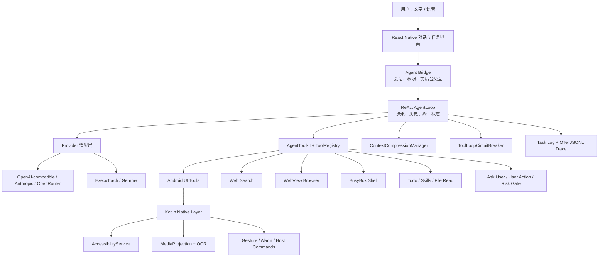

<div align="center">

# 豆泡（DouPao）

**运行在 Android 手机上的通用 AI Agent**

既能连续对话和回答问题，也能按需使用手机 UI、联网搜索、内置浏览器、隔离 Shell 与 Android 系统能力完成真实任务。


</div>

## 项目定位

移动端大量能力封闭在 App 内，很多事项无法通过开放 API 完成；复杂功能又往往入口深、步骤多、反馈异步，对中老年用户尤其不友好。豆泡希望把自然语言变成统一入口，让用户不必理解每个 App 的菜单结构：

- 普通知识、分析与解释直接对话完成；
- 需要最新信息时调用联网搜索或内置浏览器；
- 需要计算、文本处理、文件操作或确定性系统能力时调用 Shell；
- 必须进入 App 时，通过 Android UI 工具观察并操作真实界面；
- 涉及支付、发送、删除或账户变更时，在执行前暂停并请求用户授权。

豆泡不是固定流程脚本，也不先用分类器把请求切成“问答”或“操作”。所有能力以标准工具接入同一个 AgentLoop，由模型结合目标、证据、成本和风险选择路径。

## 产品定位与迭代时间线

> 时间线同时记录产品重心变化及支撑该变化的关键工程能力；日期以仓库提交和现有变更记录为准。

| 时间 | 产品定位变化 | 主要迭代与优化 |
| --- | --- | --- |
| 2026-08-13 | **端侧手机助手与屏幕看护**：以语音或文字控制手机，并支持周期性检查屏幕条件。 | 建立 React Native 应用、端侧模型、无障碍控制、悬浮窗、任务历史和 `/watch` 定时看护链路。 |
| 2026-08-15 | **聚焦手机代操作**：从“定时观察”扩展到目标驱动的连续执行，优先解决复杂 App 路径的代操作问题。 | 确立单主 Agent 的 ReAct 循环；引入执行中打断、敏感操作确认、模型配置与连续观察执行。产品更名为“豆泡”。 |
| 2026-08-16 | **形成可独立演进的 Agent 内核**：不再把能力绑定在单一手机操作流程中。 | 将 AgentLoop、Provider 和工具协议内聚到工程；建立结构化消息、工具调用/结果配对、Prompt Cache 与 Token 用量统计；增加任务完成确认。 |
| 2026-08-17～08-19 | **从一次性指令走向可持续交互**：任务执行过程中允许纠正、澄清和继续。 | 完善前后台悬浮交互、完成/继续决策、执行状态恢复和后台保活；关键等待逐步迁移到 Android 原生 Alarm，缓解系统冻结 JS 定时器的问题。 |
| 2026-08-22 | **强化真实 App 操作可靠性**：重点解决移动端坐标易失效、列表节点复用和动作成功不等于页面推进的问题。 | 建立短期 `ref` 与 `observationId` 证据协议；统一语义定位和归一化视觉坐标；区分动作已派发与结果已验证，减少重复点击和错误路径试探。 |
| 2026-08-24 | **升级为通用移动智能体**：除手机 UI 外，开始覆盖问答、网页、数据处理和 Android 确定性能力。 | 引入内置浏览器、隔离 Shell、Android 宿主命令、Todo、Skills、用户澄清和工具配置；增加大工具结果落盘与分页读取，形成可扩展工具体系。 |
| 2026-08-26 | **面向长任务与连续对话稳定运行**：重点从“能调用工具”转向“能长期保持正确上下文”。 | 建立 Provider 无关的结构化历史、分层提示词与 Prefix Cache；完善上下文压缩、浏览器原生观察、任务完成后的三路选择和工具循环熔断。 |
| 2026-08-28 | **面向成本、安全与可观测性优化**：让移动 Agent 的执行过程可控制、可复盘。 | 增加端侧 OCR 与截图标记；统一工具输出 Schema；模型评估单次工具风险，运行时冻结高风险调用；记录符合 OpenTelemetry 数据模型的本地 JSONL Trace；按模型上下文窗口管理预算。 |
| 2026-08-30～当前 | **完善端侧闭环与弱环境适应能力**：降低权限中断、复杂页面和异步反馈对任务成功率的影响。 | 增加联网搜索、截图与定位权限的可恢复授权；为无障碍树设置耗时、节点数和深度预算，截图与结构采集故障隔离；Shell 收敛为 BusyBox；取消单个 UI 动作后的固定等待，仅在同轮连续变更操作之间短暂稳定，其他异步结果由显式 Wait/轮询工具处理。 |

当前产品定位是：**端侧优先、支持连续对话、能够在问答与真实设备操作之间自主选择路径的通用移动智能体**。屏幕看护作为只读定时任务继续保留，但不再是产品的唯一中心。

## 核心能力

### 通用 AgentLoop

- 以 ReAct AgentLoop 统一直接回答、工具调用、用户交互和任务终止；主循环不预设固定业务工作流。
- 内部使用 Provider 无关的结构化消息，适配 OpenAI-compatible、Anthropic、OpenRouter 与端侧 Gemma。
- 支持连续对话、中途用户消息注入、任务超时、模型请求超时、短暂错误重试、主动停止和完成后继续。
- Todo 为多阶段任务提供持续可见的目标和完成条件；简单任务不强制规划。
- 主循环不自动读取屏幕，所有环境感知均由模型按需调用工具获得。

### 移动端 GUI

- `ui_inspect` 提供有界的无障碍结构；`ui_screenshot` 提供图像，并可携带近似同帧结构与端侧 OCR 结果。
- 无障碍节点与 OCR 目标统一为短期 `ref`；纯视觉目标使用携带 `observationId` 的归一化坐标，避免复用过期位置。
- 支持点击、长按、文本输入、滚动、滑动、应用启动、系统导航及节点状态读取等操作。
- 动作返回值只表达派发结果，不把系统接受手势等同于业务完成；模型根据后续证据决定是否继续观察或验证。
- 复杂无障碍树受到耗时、遍历节点数、深度和结果数预算约束；预算耗尽时返回部分结果和截断原因，避免阻塞整个工具链。
- 图片与结构树并行采集、故障隔离；结构树超时不会使已获得的截图失效。

### 异步等待与证据管理

- 提供通用 `wait`、`ui_wait_for_node`、`ui_wait_for_change` 和浏览器稳定等待，由模型在下一步确实依赖异步结果时主动调用。
- 部分专用工具在内部完成必要的状态轮询或权限恢复，减少模型重复发起相同动作。
- 单个 UI 动作完成后不再追加固定等待；仅在模型同一轮连续调用多个界面变更工具时，在工具之间执行短暂 settle，防止后续动作抢跑。
- 截图只用于一次相关视觉推理，长期有效的结论转为 `visual_memory`；界面变化后旧截图、ref 与坐标失效，降低状态漂移和多模态 Token 消耗。

### 联网搜索与内置浏览器

- `web_search` 用于获取时效信息和近期数据，支持搜索类别、时间范围、结果数与来源域名约束。
- 内置浏览器使用独立 WebView 会话，提供网页导航、读取、语义查找、点击、输入、滚动、稳定等待及标签页管理。
- 浏览器 DOM 状态与手机前台 UI 状态相互独立，网页变化不会触发无意义的手机无障碍观察。
- 仅允许公开 HTTP/HTTPS 地址，拒绝回环和私网访问；网页内容按不可信外部数据处理。

### 隔离 Shell 与 Android 宿主能力

- `shell_execute` 使用 APK 内置 BusyBox，在应用私有工作区执行计算、文本处理、数据转换、文件操作、网络请求和运行时诊断。
- Android 框架能力通过受控宿主命令开放，覆盖设备信息、剪贴板、通信编辑器、地图、定位、系统设置、日历、分享、闹钟、通知与系统 TTS。
- Shell 不是 Android 系统终端，不提供 ADB、包管理器或系统设置写权限；高风险调用继续经过统一授权边界。

### 工具治理与 Human-in-the-Loop

- 工具使用统一 Schema 和成功/失败结果协议；错误代码、可重试性与提示会作为工具结果返回模型。
- 普通工具可独立启停并配置模型可见元信息；内部协议与安全工具保持强制注册。
- `ask_user` 在缺少必要信息时暂停任务；`request_user_action` 处理必须由用户手动完成的步骤。
- 模型为可能改变外部状态的每次调用声明风险；运行时冻结高风险调用，获得用户授权后才执行原调用。
- ToolLoopCircuitBreaker 对工具别名、参数和相近坐标进行规范化，识别无进展的等价操作；先预警、后阻断，连续阻断达到阈值时安全终止。

### Skills 渐进式经验

- 用户可以把特定场景的操作经验保存为 Skill，用于缩短执行路径、降低试错与提高稳定性。
- 每轮只注入名称和描述目录；场景匹配时模型再调用 `read_skill` 加载正文，避免所有经验长期占用上下文。
- Skill 存储与 AgentLoop 解耦，运行时只依赖目录和按名称读取接口。

### 上下文工程

- 提示词按稳定性组织：稳定规则、任务级上下文、结构化历史和实时运行状态分层注入。
- 稳定前缀通过 Provider 的 Prompt/Prefix Cache 复用，并记录缓存命中 Token。
- `ContextCompressionManager` 统一负责大结果卸载、Token 估算和阈值摘要；保留最近完整轮次及最新 UI 证据。
- 超预算的工具结果写入应用私有目录，历史只保留预览、大小和逻辑路径；模型可通过受限 `file_read` 分页读取。
- 压缩只改变发送给模型的有效上下文，完整任务事件仍作为日志事实源保留。

### 可观测性

- 记录模型请求、工具执行、熔断、授权、完成状态、Token 使用、缓存命中和阶段耗时。
- 本地 Trace 采用 OpenTelemetry Span 数据模型与 `gen_ai.*` 语义字段，以 JSONL 保存，便于分析任务耗时和失败路径。
- 任务日志与 Trace 共用同一执行事实，避免 UI 日志和诊断数据出现两套口径。

## 架构总览



## 代码分层

```text
doupao/
├── Readme.md
├── PROJECT_EXPERIENCE.md
├── guidedog-agent/                    # React Native 应用与 Agent 运行时
│   ├── app/                           # 对话、历史、引导、设置页面
│   ├── src/agent/                     # App 与 AgentLoop 桥接、提示词、Trace
│   ├── src/device-agent/              # AgentLoop、Provider、Tools、上下文与熔断
│   ├── src/browser/                   # 内置浏览器会话与工具
│   ├── src/web-search/                # 联网搜索工具
│   ├── src/shell/                     # Shell 工具协议
│   ├── src/store/                     # 会话、设置、技能与执行状态
│   ├── plugins/android/               # Kotlin 原生服务、Shell 与系统能力
│   └── android/                       # Android Gradle 工程
├── react-native-accessibility-controller/
│   ├── src/                           # React Native API 与轮询工具
│   └── android/                       # AccessibilityService、手势、截图与悬浮窗
├── openspec/                          # Proposal、Design、Spec 与任务记录
└── OpenMinis/                         # 架构调研与对照源码
```

整体分为两种语言层：

- **React Native / TypeScript**：产品 UI、Agent 运行时、工具编排、Provider、上下文和状态管理；
- **Kotlin / Android**：无障碍服务、手势派发、截图、OCR、悬浮窗、后台保活、权限和宿主系统能力。

## 技术栈

- React Native 0.81、React 19、Expo 54、TypeScript 5.9
- Kotlin、Android AccessibilityService、MediaProjection、Foreground Service、Alarm
- React Native WebView
- ExecuTorch + Gemma 端侧模型
- BusyBox
- AsyncStorage + 轻量发布订阅 Store
- Jest、ts-jest、TypeScript strict 检查

## 本地开发

### 环境要求

- Node.js 18+
- JDK 17
- Android SDK / Build Tools
- Android 8.0（API 26）及以上真机
- 与主工程同级的本地依赖：
  - `react-native-accessibility-controller`
  - `react-native-executorch`

### 安装依赖与校验

```bash
cd guidedog-agent
npm install
npm run typecheck
npm test -- --runInBand --forceExit
```

### 构建 Release APK

```bash
cd guidedog-agent/android
NODE_ENV=production ./gradlew :app:assembleRelease
```

输出位置：

```text
guidedog-agent/android/app/build/outputs/apk/release/app-release.apk
```

开发阶段覆盖安装：

```bash
adb install -r app/build/outputs/apk/release/app-release.apk
```

Debug 构建依赖 Metro，独立装机请使用 Release APK。

## 首次运行

1. 安装并打开豆泡；
2. 按引导开启无障碍服务和悬浮窗权限；
3. 配置云端模型，或下载并加载端侧 Gemma 模型；
4. 首次使用截图时，根据系统提示授权屏幕捕获；
5. 使用语音或定位能力时授予相应权限；
6. 在 MIUI/HyperOS 等系统上，建议关闭豆泡的电池优化限制。

## 当前边界

- 无障碍树质量由目标 App 决定；Canvas、游戏和部分 WebView 仍需依赖视觉信息。
- 动作已派发、页面已变化和业务目标已完成是三个不同状态，最终结果仍需证据验证。
- BusyBox 覆盖常用 Unix 命令，但不是完整 Linux 发行版；未内置的复杂依赖无法直接安装。
- Shell 不具备 Android 系统特权；系统操作只能通过明确开放的宿主命令或 UI 工具完成。
- 内置 WebView 的登录兼容性受站点策略影响，不能完全替代系统 Chrome。
- Android ROM 对无障碍手势、后台启动和进程冻结的限制不同，需要持续真机回归。

## 参考项目

- [OpenMinis](https://github.com/OpenMinis/OpenMinis)：通用助手、浏览器工具和工具循环治理参考。
- [MobileAgent](https://github.com/X-PLUG/MobileAgent)：移动端 Agent 感知与操作范式参考。
- [react-native-executorch](https://github.com/software-mansion/react-native-executorch)：端侧模型运行时。

## License

`guidedog-agent` 使用 MIT License；第三方运行时及本地依赖遵循各自许可证。BusyBox 的来源与许可证见 `guidedog-agent/assets/shell/NOTICE.md`。
