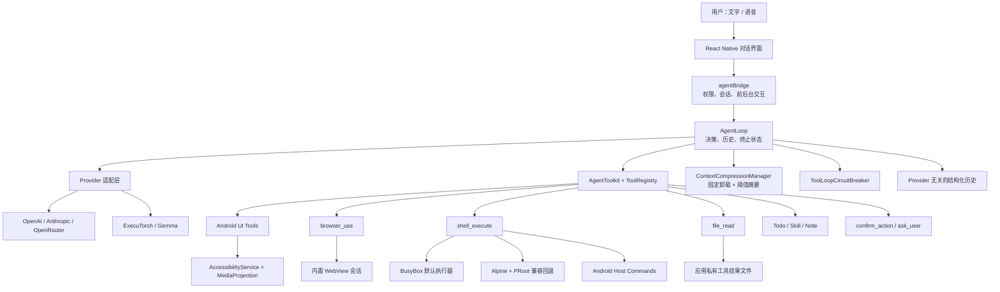

<div align="center">

# 豆泡（DouPao）

**运行在 Android 手机上的通用 AI Agent**

既可以直接回答问题，也可以按需调用手机 UI、内置浏览器、隔离 Shell 与 Android 系统能力完成真实任务。


</div>

## 项目简介

豆泡不是固定流程的自动化脚本，也不依赖单独的“问答/操作”意图分类器。它把 Android UI、网页、Shell、任务管理和用户卡控封装为标准工具，由模型根据当前用户目标选择最短、可靠且安全的路径：

- 能凭已有知识可靠回答时，直接返回文字。
- 需要实时信息、计算、网页、文件或设备状态时，调用对应工具。
- 下一步确实依赖手机界面时，主动读取结构或截图。
- 执行手机代操作后，根据真实返回值和后续状态验证结果。
- 支付、发送、删除、账户修改等高风险动作，在最终提交前强制确认。

豆泡运行时不依赖 ADB。ADB 仅用于开发阶段的构建、装机、日志和真机回归。

## 核心能力

### 通用 AgentLoop

- 在直接回答、工具调用、用户澄清、任务清单和任务终止之间统一决策。
- 不在主循环中默认注入截图或无障碍树，观察成本由模型按需承担。
- 最大步骤支持 1–200，默认 50；任务完成确认为“继续”时至少追加 10 步。
- 默认使用 Token 感知的上下文管理：固定规则卸载旧工具结果，达到单一安全阈值后用 LLM 摘要较早历史。
- 保留最近完整工具轮次和最新 UI 观察；旧滑动窗口仅作为可配置回退路径，默认窗口为 20 轮。
- 支持任务超时、模型请求超时、短暂错误重试、主动停止和压缩状态展示。
- 系统提示词保留最近 5 个版本，可按版本 ID 回滚。

### Android UI 操作

- `inspect_ui`：读取当前无障碍元素树。
- `screenshot`：一次返回截图和同一时刻的无障碍树。
- 点击、长按、文本输入、清空、回车、精细滑动、普通滚动、分页滚动、系统导航和应用启动。
- `find_node` 返回 `nodeId / text / bounds / center / matchCount`，用于处理列表复用相同资源 ID 的情况。
- `tap` 优先执行节点点击；只有节点动作明确被拒绝时才回退一次坐标点击，避免重复提交。
- 点击后在本地轮询无障碍树、前台应用，并在可用时结合截图像素差异判断页面是否真的变化，不额外调用视觉模型。
- 强制视觉模式会关闭独立结构查询工具，但截图仍同时携带无障碍树。

### 内置浏览器

- 基于 React Native WebView 的独立 `browser_use` 工具域，与手机 UI 主链路解耦。
- 支持网页导航、正文提取、DOM 骨架、语义查找、稳定 ref、点击、输入、滚动和长列表采集。
- 支持页面稳定等待、网页截图、受限 JavaScript、会话内资源抓取、Cookie、视口和 User-Agent。
- 最多管理 3 个标签页。
- 默认以吸附屏幕右侧的小窗展示，用户可以手动切换全屏。
- 仅允许公开 HTTP/HTTPS 地址，拒绝回环和私网地址；网页内容统一标记为不可信数据。

### 隔离 Shell 与 Android 宿主命令

- `shell_execute` 的默认执行器是 APK 内置 BusyBox，适合计算、文本处理、数据转换、文件操作、网络请求和运行时诊断。
- 保留 Alpine Linux + PRoot 作为兼容回退，可通过运行时标记切换，便于验证 BusyBox 迁移后的兼容性。
- 两种执行器共享应用工作区，对 Agent 暴露的工具名称和参数保持不变。
- Android 框架能力通过受控宿主命令开放：
  - `android-device`：设备、系统、电池、存储信息。
  - `android-clipboard`：读取、写入或清空剪贴板。
  - `android-open`：打开公开 URL 或 `sms:` 等系统 URI。
  - `android-alarm`：打开闹钟、创建闹钟或计时器。
  - `android-notification`：发送或清理豆泡通知。
  - `android-speak`：调用系统 TTS。
- 沙箱不是 Android 系统 Shell，不提供 `adb`、`am`、`pm`、`settings`、`getprop` 或 Shizuku 特权。

### 工具治理

- 普通工具可以独立启用或禁用，并可修改界面显示名称、模型可见描述等元信息；规范工具名和参数协议保持稳定。
- 内部协议工具可以绕过用户预设恒定注册。`file_read` 不出现在工具设置中，不允许禁用或改写元信息。
- 参与循环检测的普通工具支持独立的预警和阻断阈值；安全卡控和内部协议工具不向用户开放这项配置。
- ToolLoopCircuitBreaker 会规范化工具别名、参数和坐标，识别语义等价的重复动作。
- 结合工具结果、页面变化信号和任务状态判断是否取得进展；观察类工具只预警，不强制阻断。
- 工具结果使用统一成功/失败结构，并按工具类型应用独立结果预算。

### 大结果落盘与按需读取

- 工具结果在超过各自模型可见预算时，会先将完整文本写入应用私有目录，再把历史中的结果替换为头尾预览、原始大小和逻辑路径。
- 没有独立预算的大型 UI 观察使用 50K 字符兜底阈值；敏感结果不落盘，写入失败则回退为原有内联结果。
- 模型可以用内置 `file_read(path, offset, limit)` 分页读取完整内容，单次最多 8K 字符；该工具只接受 `/tool-results/<会话>/<文件>` 引用，不是通用文件系统读取器。
- 结果以每次工具调用一个文件的粒度保存，最多保留最近 20 个会话目录或 7 天。
- 页面校验和循环熔断仍使用完整工具结果，落盘引用只在进入模型历史前生成。

### 安全与用户卡控

- `confirm_action`：支付、购买、发送、删除、重置和账户/隐私修改等高风险动作的强制授权入口。
- `ask_user`：仅在缺少会实质影响结果、路径或风险的必要信息时暂停任务。
- 一次确认只授权描述中的具体动作、对象、金额、内容和范围。
- 任务完成或步数耗尽后提供“完成 / 继续 / 补充信息”三个选项。
- 豆泡在前台时使用对话页内嵌卡片；后台代操作时使用悬浮窗。“完成”和“继续”留在当前 App，“补充信息”才调回豆泡输入。
- Android 原生 Alarm 驱动关键等待，降低 MIUI/HyperOS 后台冻结 JS 定时器带来的影响。

### 会话、经验与可观测性

- 会话历史、收藏指令、最近指令、Token 用量和模型缓存命中统计。
- 云端模型选择支持关键词 Suggest：每次 App 进程启动最多刷新一次 `models.dev` 目录和当前 Provider 的 `/models` 结果，本地缓存供离线使用，同时允许直接输入任意模型 ID。
- 经验支持新增、编辑、禁用和删除；删除前统一二次确认。
- 经验采用渐进加载：任务提示只携带目录，命中场景后通过 `read_skill` 读取正文。
- 思考与执行合并为一个折叠组件，使用白色/浅灰背景区分，两类出入参默认只显示一行。
- 工具调用、熔断、完成状态和错误会写入任务日志，便于复盘真实 Agent 轨迹。

## 架构总览



## 关键设计

### 1. 统一决策，不做固定意图分流

系统把豆泡定义为通用移动端助手。模型根据目标和当前事实自主选择直接回答、调用工具或请求必要信息。需要硬约束的内容，例如高风险授权和工具权限，由运行时协议保证，而不是依赖容易误判的意图标签。

### 2. 观察也是工具

主循环不会默认读取屏幕。只有下一步依赖手机 UI 时，模型才调用 `inspect_ui` 或 `screenshot`。截图与当前 UI 状态绑定：只读定位可以继续使用同一证据；点击、滚动、输入、等待等可能改变页面的动作会使旧图失效。

### 3. Provider 无关的标准历史

内部历史使用统一结构：

```ts
type ModelContent =
  | { type: 'text'; text: string }
  | { type: 'tool_call'; id: string; name: string; arguments: object }
  | { type: 'tool_result'; callId: string; result: ToolResult };
```

Provider 层分别转换为：

- OpenAI-compatible：`assistant.tool_calls` + `role=tool`
- Anthropic：`tool_use` + `tool_result`
- 本地文本模型：紧凑的兼容文本协议

因此 AgentLoop、历史存储、敏感结果脱敏和工具错误处理不依赖单一模型 API。

### 4. 分层提示词与 Prefix Cache

每次模型请求按稳定性分层组装：

```text
system
  固定 AGENT_SYSTEM_PROMPT

首条 user <runtime_context>
  当前任务 + 运行上下文 + 用户附加说明 + 可用经验目录
  + 可选 <context_summary>

结构化历史
  assistant.tool_call <-> user.tool_result 完整配对

对话尾部 user
  Todo + 熔断提醒等最新运行状态
```

- 固定规则保留在真正的 system prompt，可跨任务复用前缀缓存。
- 任务级内容保持 user 权限，不会被错误提升为系统指令，并可在同一任务内缓存。
- 云端 Provider 通过 API 原生 `tools` 字段传递工具 schema；历史中最后一条稳定 assistant 消息作为额外缓存分界，尾部动态状态不破坏旧前缀。
- Anthropic 使用显式 `cache_control`；OpenAI-compatible Provider 读取并记录自动缓存命中量。

### 5. 单阈值上下文管理

`ContextCompressionManager` 是模型上下文缩减的唯一责任边界，默认替代简单滑动窗口：

1. 每次组装请求时只执行一次固定规则卸载，将较早的截图、UI 树、浏览器、Shell 等大结果替换为紧凑占位。
2. 保留最近 4 个完整轮次，并额外保留最新一次 UI 观察，避免最新指令、工具配对和当前页面证据被改写。
3. 按模型上下文窗口估算 Token，只有达到“上下文窗口减去输出保留量”这一安全阈值时，才调用 LLM 摘要较早的连续历史。
4. 新摘要与旧 checkpoint 合并为自然语言正文，以 `<context_summary>` 作为历史背景注入下一轮；原始事件记录仍是事实源。
5. 每次决策不循环卸载、不递归调用多次摘要。摘要后仍超限或非短暂错误会直接报错；网络、限流、5xx 等短暂错误最多重试 3 次。

用户可在设置中关闭“智能上下文压缩”，回退为旧版固定轮次窗口。跨 AgentLoop 的普通用户/助手文字对话另行按“连续会话保留对话轮数”注入，默认 8 轮、总长度上限 8K 字符，与任务内工具历史压缩不是同一概念。

### 6. 页面变化不能只相信 `true`

原生点击接口返回成功，通常只说明动作已派发。豆泡把结果进一步区分为：

- `verified_changed`：已检测到结构、前台应用或画面发生变化。
- `verified_unchanged`：确认动作后页面没有变化。
- `accepted_unverified`：动作被系统接受，但当前证据不足以验证。

这样模型不会把“接口返回 true”误判为业务目标已经推进。

### 7. 工具循环熔断

熔断器不额外观察页面，而是消费已有的工具调用与结果：

1. 规范化工具名和参数。
2. 对接近坐标进行网格化，识别重复点击。
3. 比较结果指纹和显式页面变化信号。
4. 达到工具独立阈值时先预警，再阻止等价动作继续执行。
5. 检测到真实进展后清除无进展状态并记录恢复事件。

## 目录结构

```text
vision-route-search/
├── Readme.md                         # 项目说明
├── PROJECT_EXPERIENCE.md             # 面试/项目介绍材料
├── guidedog-agent/                   # 豆泡 React Native App
│   ├── app/
│   │   ├── chat/                     # 对话与内嵌卡控
│   │   ├── history/                  # 会话历史
│   │   ├── onboarding/               # 权限与初始化
│   │   └── settings/                 # 通用、模型、工具、经验设置
│   ├── src/
│   │   ├── agent/                    # App 与 AgentLoop 桥接、系统提示词
│   │   ├── browser/                  # WebView 浏览器会话与工具
│   │   ├── device-agent/             # AgentLoop、Provider、Tools、熔断
│   │   ├── modelCatalog/              # 模型目录拉取、缓存与搜索
│   │   ├── shell/                    # shell_execute 工具协议
│   │   └── store/                    # AsyncStorage 与轻量 Store
│   ├── plugins/android/              # Android 服务、Receiver、Shell 运行时
│   └── android/                      # Android Gradle 工程
├── react-native-accessibility-controller/
│   ├── src/                          # React Native API
│   └── android/                      # AccessibilityService 原生实现
├── openspec/                         # Proposal、Design、Spec 与任务记录
└── OpenMinis/                        # 架构调研与对照源码
```

## 技术栈

- React Native 0.81、React 19、Expo 54、TypeScript 5.9
- Kotlin、Android AccessibilityService、MediaProjection、Foreground Service、Alarm
- React Native WebView
- ExecuTorch + Gemma 端侧模型
- BusyBox；Alpine Linux + PRoot 兼容运行时
- AsyncStorage + 轻量发布订阅 Store
- Jest、ts-jest、TypeScript strict 检查

## 本地开发

### 环境要求

- Node.js 18+
- JDK 17
- Android SDK / Build Tools
- Android 8.0（API 26）及以上真机
- 当前仓库约定位置的本地依赖：
  - `react-native-accessibility-controller`
  - `react-native-executorch`

### 安装依赖

```bash
cd guidedog-agent
npm install
```

### 类型检查与测试

```bash
npm run typecheck
npm test -- --runInBand --forceExit
```

### 构建 Release APK

```bash
cd guidedog-agent/android
NODE_ENV=production ./gradlew :app:assembleRelease
```

APK 输出位置：

```text
guidedog-agent/android/app/build/outputs/apk/release/app-release.apk
```

开发阶段覆盖安装：

```bash
adb install -r app/build/outputs/apk/release/app-release.apk
```

不要把 Debug APK 当作离线安装包；Debug 构建依赖 Metro，独立装机应使用 Release APK。

## 首次运行

1. 安装并打开豆泡。
2. 按引导开启无障碍服务和悬浮窗权限。
3. 根据需要配置云端模型，或准备端侧 Gemma 模型。
4. 使用截图时按系统提示授予 MediaProjection 权限。
5. 使用语音时授予麦克风权限。
6. 在 MIUI/HyperOS 上建议关闭豆泡的电池优化限制。

## 当前边界

- 无障碍树质量由目标 App 决定；Canvas、游戏及部分 WebView 必须依赖视觉信息。
- 像素差异只能证明画面发生变化，不能单独证明业务目标已经达成。
- BusyBox 覆盖常用 Unix 命令，但不是完整 Linux 发行版；复杂依赖可切换 Alpine+PRoot 兼容运行时。
- Shell 无 Android 系统特权；系统级操作只能使用明确开放的宿主命令或 Android UI 工具。
- 内置 WebView 的登录兼容性受站点策略影响，不能替代完整 Chrome 环境。
- 不同 Android ROM 对无障碍手势、后台启动和进程冻结的限制不同，需要持续真机回归。

## 参考项目

- [OpenMinis](https://github.com/OpenMinis/OpenMinis)：通用助手、浏览器工具与工具循环治理的设计参考。
- [MobileAgent](https://github.com/X-PLUG/MobileAgent)：移动端 Agent 感知与操作范式参考。
- [react-native-executorch](https://github.com/software-mansion/react-native-executorch)：端侧模型运行时。

## License

`guidedog-agent` 使用 MIT License；第三方运行时及本地依赖遵循各自许可证。BusyBox、PRoot 和 Alpine 相关来源与许可证见 `guidedog-agent/assets/shell/NOTICE.md`。
