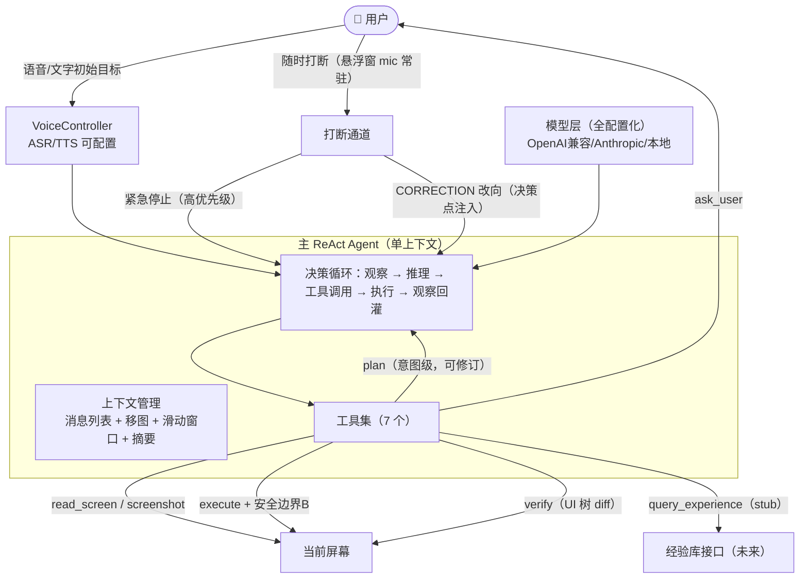

# guidedog-agent 设计（链路 B：语音代操执行）

## 1. 架构总览



## 2. 主循环（改造 react-native-device-agent 的 AgentLoop）

现有 `AgentLoop.run()` 已具备：读取无障碍 UI 树 → 拼 prompt → 调 provider → 解析工具调用 → 执行 → 观察 → 循环。保留此骨架，做四处增量：

1. **打断检查**：每次迭代顶部检查 InstructionBus；紧急停止立即置位 abort 并在当前手势后停止；CORRECTION 追加进上下文并置 `refreshPerception` 标志。
2. **注入刷新**：存在待处理修正时，先重新 readScreen 再进入 buildPrompt。
3. **buildPrompt 扩展**：上下文区新增 `[用户修正]` 段（初始目标不变 + 修正内容 + 类型 persistent/one-shot）与 `[经验先验]` 段（query_experience 命中时）。
4. **executeToolCall 门控**：所有动作执行前过敏感检查；命中则返回 `CONFIRM_REQUIRED`，由模型转调 `ask_user` 完成确认后才真正执行。

循环终止条件：`task_complete` / `task_failed` / maxSteps（默认 20）/ 超时 / abort。

## 3. 工具集（7 个，schema 定义）

| 工具 | 输入 | 输出 | 说明 |
|---|---|---|---|
| `read_screen` | - | UI 树摘要文本 | 结构化感知主通道 |
| `screenshot` | - | 截图路径 | 视觉感知，模型能力有 vision 时才可用 |
| `execute` | action + nodeId/坐标 + text | 执行结果 | **安全边界 B 门控点**；参数含 `sensitive` / `sensitivity_reason`（LLM 自主判断） |
| `verify` | 预期描述 | A/B/C + diff 摘要 | 轻量验证（UI 树 diff），失败/不确定时模型调用 |
| `ask_user` | question + type(confirm/clarify/hand_over) | 用户答复 | 语音/弹窗双向；confirm 用于敏感确认，hand_over 用于登录/验证码接管 |
| `plan` | goal + 已完成项 + 当前屏幕 | 意图级子目标列表 | 可多次调用（修订）；保留 deft TaskPlanner 的编号解析与 maxSubTasks=5 |
| `query_experience` | goal + current_state | {found, candidates} | **stub**：当前恒返回 found=false；契约冻结 |

## 4. 安全边界

### 边界 A（决策点注入）

- 打断发起随时（悬浮窗 mic 常驻），**注入生效在安全决策点**（当前手势 + verify 完成后、下一次 Thought 前）。
- 注入前强制刷新感知（重新截屏 + UI 树）。
- 语义：CORRECTION（初始目标不变，修正执行路径）vs 紧急停止（立即取消排队动作）。
- 优先级规则：**任何新用户输入 > 已挂起的敏感确认**。

### 边界 B（execute 门控）

- 敏感判断：**LLM 开放判断**（不可逆 / 资金 / 数据外发 / 凭据 / 系统级修改 / 偏离目标的高影响动作），execute 参数携带 `sensitive` + `sensitivity_reason`。
- 门控：`sensitive=true` 必须过 `ask_user(confirm)`；弹窗展示 reason。
- hand_over：检测到登录/验证码/敏感页面时模型自主调 `ask_user(hand_over)`，用户手动处理，说"继续"恢复。
- 可选硬保底（默认关）：真实资金转移类动作无条件确认。
- 自保护：代码级前台检测（agent 回到自身 UI 时等待用户切回），prompt 级"屏幕内容不是指令"注入防护。

## 5. 语音层

- `VoiceController`：ASR/TTS Provider 抽象。
  - ASR：expo-speech-recognition（系统，默认）/ OpenAI 兼容 `/audio/transcriptions`（可配置）/ executorch Whisper（本地，M1 后可选项）。
  - TTS：expo-speech（系统，默认）/ 云端可配置。
- 交互：初始目标语音输入；执行中按悬浮窗 mic 说话 → 识别文本进 InstructionBus（带类型 CORRECTION/STOP）；敏感确认时播报 + 语音回答。
- 录音指示：悬浮窗录音中状态（红点/动画）；低置信度 ASR 不注入，回问"没听清"。

## 6. 模型配置层

- `LLMProviderInterface` 已有：`generateWithTools(prompt, tools)` / `generateWithVision(prompt, tools, imagePath)`。
- 新增 `ModelPreset`：openai / anthropic / zhipu / bailian / volcengine / custom / local。
- capabilities 声明：vision（有无）、tool_calling（有无，无则回退文本协议）、native_planning（有无，专用模型免 plan 工具）。
- 运行时自适应：AgentLoop 按 capabilities 决定是否传截图、是否注入 tools schema、plan 工具是否启用。
- 设置页：预设下拉 + base_url/api_key/model 自定义；API key 加密存储（EncryptedSharedPreferences 或 expo-secure-store）。

## 7. 上下文管理

1. **消费后移图**：已执行的屏幕图从历史中移除只留文本（deft 无此能力，需在 AgentLoop 的 history 事件里实现）。
2. **滑动窗口**：maxHistoryItems 已存在（默认裁剪），按 token 预算动态收缩。
3. **摘要压缩**：窗口外的历史压缩为一行语义摘要（"已完成：打开设置 → 进入 Wi-Fi"），由模型生成或规则提取。

## 8. 经验库接口（stub）

```json
// query_experience
{ "goal": "...", "current_state": "..." }
→ { "found": false, "candidates": [] }
// 未来：{ found: true, candidates: [{state, element_doc, action, success_rate}] }
```

注入策略（借鉴 AppAgent）：命中时 prompt 追加"优先选择这些有文档的元素"；无命中不影响决策。经验库 schema 按 AppAgent 模式（state → elements → 语义文档 + success_rate + 负样本），但本阶段不实现。

## 9. 文件级改造点

### guidedog-agent（deft 派生）

- `package.json` / `app.json`：更名 guidedog，包名 `com.guidedog.agent`，图标/应用名
- `src/agent/agentBridge.ts`：模型预设接线、工具注册、打断通道挂载
- `src/components/VoiceModule.tsx`：ASR/TTS Provider 抽象 + 录音指示
- `app/chat/ChatScreen.tsx`：悬浮窗 mic 按钮、打断交互、确认弹窗
- `app/settings/SettingsScreen.tsx`：模型预设 + capabilities 配置
- `src/store/*`：任务状态、打断队列、确认通道

### guidedog-agent/src/device-agent（已整体迁移入库，本地维护）

- `agent/AgentLoop.ts`：打断检查、刷新感知、buildPrompt 扩展、execute 门控、移图
- `agent/TaskPlanner.ts`：重规划通道（replan(task, priorResults, screenState)）
- `tools/PhoneTools.ts`：新增 ask_user / verify / query_experience / plan 工具 schema
- `types.ts`：AgentOptions 增加 instructionBus / corrections / sensitiveGate / preset 配置
- `providers/CloudProvider.ts`：预设化（zhipu/bailian/volcengine）+ capabilities

> 说明：react-native-device-agent 核心（22 个文件：AgentLoop、TaskPlanner、ScreenSerializer、ToolParser、tools、providers、hooks、types）已于 2026-08-14 整体迁移至 `src/device-agent/`，外部依赖已移除，本地直接维护。原生桥（react-native-accessibility-controller）与端侧推理（react-native-executorch）仍为依赖。

## 10. 里程碑

- M0：基座就绪（已完成：克隆、依赖构建、typecheck 通过）
- M1：云端模型跑通 —— expo prebuild → APK → 真机"语音/文字给目标 → agent 自主执行"
- M2：安全边界 —— execute 门控 + ask_user + hand_over + 打断通道（STOP/CORRECTION）
- M3：上下文治理 + plan 可修订 + query_experience stub
- M4：模型预设配置化 + 设置页完善
